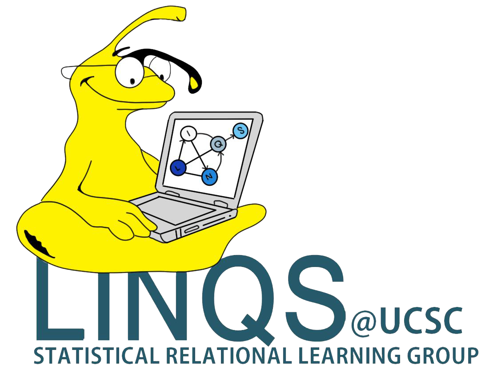

<!--  -->

# Dhawal Joharapurkar  
Ph.D. Student, Computer Science  
University of California, Santa Cruz  

<em>Curriculum Vitae: </em><a href="/files/CV_new.pdf" target="_blank">PDF</a>  <small>(April, 2017)</small>  
<em>Email: </em><a href="mailto:dhawal@ucsc.edu">dhawal@ucsc.edu</a> | <a href="mailto:dmjan21@gmail.com">dmjan21@gmail.com</a>  
<em>Office: </em>Engineering 2, 485 
<!-- 
<a href="http://doodle.com/dhawaljoh" target="_blank">Meet me!</a> | <a href="http://flask.io/yoUm1" target="_blank">Assign me a task!</a> (please let me know you've added something!)
 -->

## About Me

Currently, I'm being advised by <a href="https://getoor.soe.ucsc.edu/" target="_blank">Prof. Lise Getoor</a> as a member of the <a href="https://linqs.soe.ucsc.edu/" target="_blank">LINQS</a> group at <em><a class="tosu" href="http://www.ucsc.edu/" target="_blank">UC Santa Cruz</a></em>. During 2015-2016 I worked on predictive healthcare at Xerox Research Centre India. I graduated from <em><a class="tosu" href="http://manipal.edu/mu.html" target="_blank">Manipal Institute of Technology, Manipal</a></em> with a B.Tech in Computer Science and Engineering in May, 2015. While there, I was actively involved with the IEEE Student Branch, Manipal and served as its Techincal Secretary during 2013-14.

## Research Interests

My research focuses on mining idelogies and other latent variables in online forums to predict stance. More broadly, my interests lie at the intersection of Statistical Relational Learning, Natural Language Processing, and Machine Learning. Find more about the work I've done on my  <a href="/research/" target="_blank">research page</a>.

<!-- 
 <em><a class="tosu"> Scroll down for news! </a></em>
 -->

## News

<table style="white-space: nowrap;">
<tr>
<td width="75"><b>Feb, 17'</b></td>
<td>Attending <a href="https://www.aaai.org/Conferences/AAAI/aaai17.php" target="_b">AAAI, 2017</a></td>
</tr>
<tr>
<td><b>Nov, 16'</b></td>
<td>TAing <a href="https://classes.soe.ucsc.edu/cmps140/Winter17/" target="_blank">CMPS 140</a> in Winter, 17</td>
</tr>
<tr>
<td><b>Feb, 16'</b></td>
<td>Attending UC Santa Cruz starting Fall, 16</td>
</tr>
<tr>
<td><b>Older</b></td>
<td><a href='news-archive' target="_blank">Archive</a></td>
</tr>
</table>